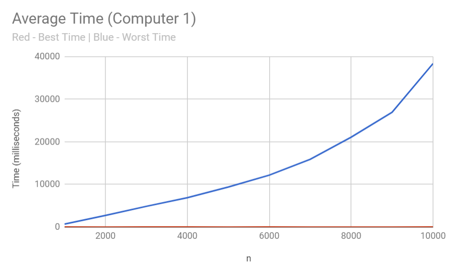
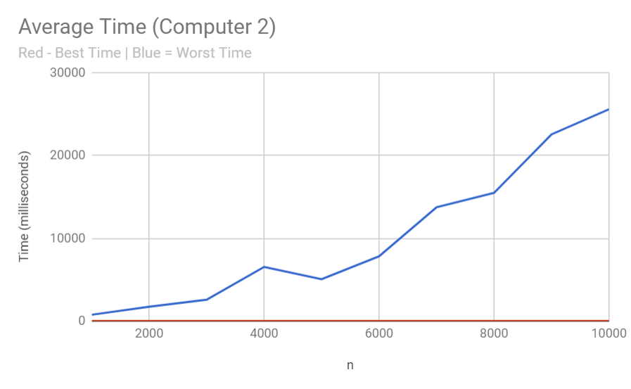

# GitCoin -- Ying Xin Jiang, Jason Kim, Mohtasim Howlader
## L 00 -- But What Does the Data Say?
### Hypothesis: 
For an n by n matrix, the worst case execution time for our serach method is O(n) because the worst case is if the number we are searching for is not in the array and the worst route it can take it a diagonal path, which is O(2n-1). 

### Background: 
The problem asks us to search for an integer in an n by n matrix in that is ascending left to right and top to bottom. Our goal is to write an algorithm that can do this with O(n) complexity. 

### Our Algorithm: 
We start in the top right corner of the matrix. We first check if our current position is the target number. We move to the left if the number we are looking for is greater than the position we are currently on. If not, we move down. Once we go out of range, we stop and return (-1,-1) as the target is not in the matrix.

### Experiment Methodology:
In order to see meaningful results, we started testing from a 1000 by 1000 matrix, and went all the way to 10000 by 10000 in increments of 1000. In each row, the numbers were ascending in a pattern of plus 2. It's the same for the column. We did this because it made getting the worst case easy; it is simply the top right integer plus 1. In each trail, we measured how long it took to finish the search 100,000 times for each matrix. We did this for both the worst and best case. We had 2 computers and ran 10 trails on each.

### Results:

The data here is very interesting. The average time seemed to start off as linear time but as the data size grew larger and larger, it looked more and more exponential. This is especially evident in the jump between n=9000 and n=10000. Computer 1 and 2 were also put into different environments. Computer 1 had nothing in the background and was "alone" for the whole process. Computer 2 was under some use, and the data shows it. There are more bumps in graph 2, showing the effect of computer use in this algorithm. 

### Compared to others: 
This is where things got interesting. Many groups decided to go by increments of something like 100 to get more data to base their line of best fit was. This very well could've been an error on our part as more data could've been useful. However, the way we tested it required a lot of time as we repeated the process for each matrix, 100000 times. Our experiment constructing could've been better in that regard. In terms of data, it seemed pretty mixed. While many groups had clear evidence of linear time, ours seemed to grow into exponentially instead. There were other groups that saw this as well, and there were other groups that had data completely different from linear or exponential. 

### Conclusion:
Due to conflicting data with other groups, it's a bit challenging to make a solid conclusion. In terms of what we have collected, the algorithm we produced, seems to run exponentially rather than linear as n grows. However, there are signs and shrivels of evidence in our data that this algorithm is linear time as well. This is very evident in the beginnings of the graph as they appear very linear. It is the end that gives us confusion.

### Unexplainable: 
1) We don't quite know why best time fluctuates a lot. There is no clear pattern.
2) We also don't know why our algo started off linear, and then suddenly spiked and turned into more of a exponential. 
